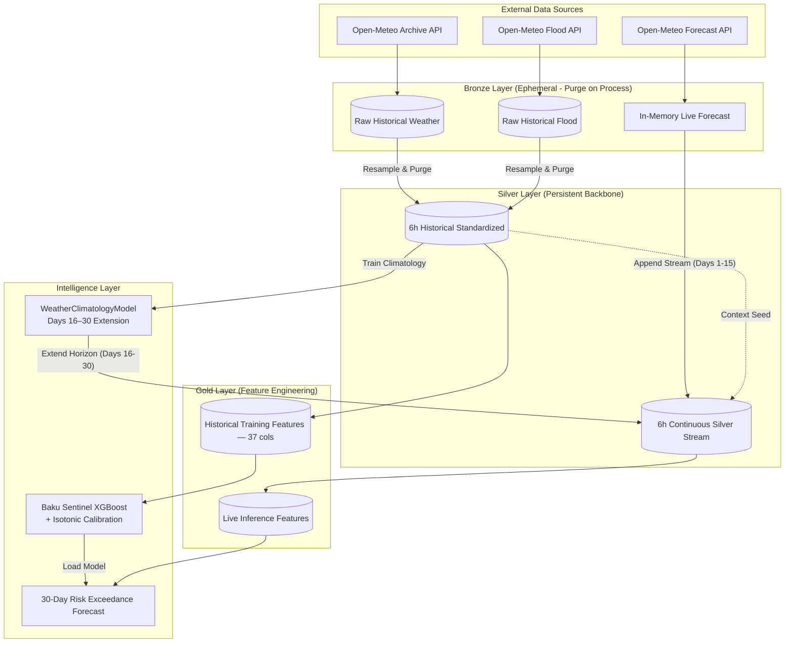

# 🌊 Baku Sentinel — Flash Flood Forecasting System

> ## **Team GALE**  

**Advanced flash flood risk prediction across Baku's terrain micro-zones using meteorological and hydrological data over a 30-day horizon.**

---

## Table of Contents

1. [Team](#team)
2. [Problem Statement](#problem-statement)
3. [Why It Matters](#why-it-matters)
4. [Target Variable](#target-variable)
5. [Dataset](#dataset)
6. [Geospatial Risk Zones](#geospatial-risk-zones)
7. [Feature Engineering](#feature-engineering)
8. [Pipeline Architecture](#pipeline-architecture)
9. [Model](#model)
10. [Risk Thresholds & Alerts](#risk-thresholds--alerts)
11. [Usage](#usage)
12. [Key Definitions](#key-definitions)
13. [Daily Activities](#daily-activities)
14. [Task Ownership](#task-ownership)
15. [Repository Structure](#repository-structure)

---

## Team

**Team Name:** Gale

| Name | Role |
|------|------|
| Ali Agabalazade | Lead ML / Data Engineer |
| Nigar Rustamova | Data Analyst / Geospatial |
| Nazrin Mammadzadeh | Project Manager / Documentation |
| Isgandar Panahov | Presentation / Documentation |

---

## Problem Statement

Standard meteorological services predict *if* it will rain. For Baku, however, the critical and often unanswered question is not the rainfall itself — it is the resulting **inundation**.

Baku sits at the intersection of three compounding risk factors:

- **Lowland coastal geography** — large portions of the city sit near sea level, with nowhere for water to drain
- **Impermeable urban surfaces** — rapid runoff with no natural absorption in dense neighbourhoods
- **Highly variable terrain** — elevation shifts from 0 m (coastal core) to 200 m (upland plateau) across a short distance, creating gravity-driven flood cascades

No dedicated, zone-aware flood forecasting system currently exists for Baku.  
Baku Sentinel fills that gap by integrating **terrain topology**, **subsurface soil saturation**, and **quantitative river discharge data** to produce **zone-specific probabilistic flood forecasts** before conditions become dangerous.

### **The core question Baku Sentinel is designed to answer:**

> "Can the integration of a 15-day Open-Meteo operational forecast with a climatological extension for days 16–30 accurately classify deterministic flood-risk events across Baku's topographic micro-zones over a rolling 30-day horizon?"

---

## Why It Matters

In Baku, flash floods are not merely a natural phenomenon; they represent a total **systemic paralysis** of the city's aging infrastructure. This project is critical for several real-world reasons:

* **Logistical Paralysis and "Tunnel Traps":** Baku's drainage and sewage systems are largely outdated and cannot cope with modern precipitation intensity. Key transit arteries, particularly underpasses and tunnels (such as the Sabunçu tunnel), transform into dangerous water traps within minutes. The sight of buses and vehicles submerged is not just a delay — it is a direct threat to public safety.
* **Urban Mobility and Pedestrian Paralysis:** The crisis is not limited to vehicles; it deeply affects daily human movement. Poor drainage turns sidewalks into impassable basins and covers streets in a layer of mud and stagnant water. For the average citizen, simple transit becomes an obstacle course, effectively paralyzing pedestrian mobility and cutting off access to public transport hubs and essential services.
* **Invisible Soil Saturation:** In a heavily "concretized" city like Baku, natural absorption is minimal. However, during consecutive rainy days, the remaining soil layers and green zones reach a saturation "tipping point." Our system tracks this "soil memory," predicting when even a moderate rainfall will trigger a catastrophic surface runoff.
* **Zone-Specific Precision vs. Alert Fatigue:** Issuing a blanket flood warning for the entire city is ineffective and leads to public indifference. Because of Baku's unique topography, one district may remain dry while another is underwater. Micro-zone forecasting allows for a proportional, targeted response that saves resources and maintains public trust.

---

## Target Variable

| Property | Definition |
|----------|------------|
| **Variable name** | `is_flood` |
| **Type** | Binary (0 = No Flood, 1 = Flood) |
| **Source** | Open-Meteo Flood API — `river_discharge` field |
| **Discharge threshold** | `river_discharge > 1.0 m³/s` |
| **Compound condition** | `river_discharge > 1.0` **AND** (`precipitation > 1.0 mm` **OR** `relative_humidity > 85%`) |
| **Temporal design** | Discharge from day *D−1* labels the 6-hour slots on day *D* — prevents same-day lookahead leakage |
| **Granularity** | 6-hourly (resampled from hourly source) |
| **Rationale** | 1.0 m³/s represents the empirical exceedance threshold at which local drainage systems in Baku's risk zones are overwhelmed. The compound condition filters meteorological coincidence from genuine flood events. |

The threshold-based labeling strategy was chosen deliberately over subjective news-scraping labels to ensure **reproducibility**, **objectivity**, and **quantitative traceability** of the flood definition.

---

## Dataset

| Property | Detail |
|----------|--------|
| **Sources** | Open-Meteo Archive API (weather), Open-Meteo Flood API (discharge), Open-Meteo Forecast API (live) |
| **Historical range** | 2020-01-01 → 2026-04-20 |
| **Forecast horizon** | 30 days rolling (15-day live + 15-day climatological extension) |
| **Raw granularity** | Hourly |
| **Processed granularity** | 6-hourly (Silver layer standard) |
| **Spatial coverage** | Baku metropolitan area, Azerbaijan |
| **Zones** | 3 terrain-based micro-zones (see below) |
| **Gold layer rows** | ~27,600 rows across 3 zones |
| **Class imbalance** | ~1% flood rate (1:93 imbalance ratio) |
| **Storage format** | DuckDB (Bronze/Silver/Gold layers) |

---

## Geospatial Risk Zones

Baku is divided into three **Terrain Risk Zones** derived from GADM (Database of Global Administrative Areas) administrative boundaries and digital elevation models.

| Zone | Designation | Elevation (m a.s.l.) | Flood Rate | Risk Level | Rationale |
|------|-------------|----------------------|------------|------------|-----------|
| **High Relief** | Upland Plateau | 100 – 200 m | ~0.4% | 🟢 STABLE | Elevated terrain enables rapid runoff; minimal local standing water, but acts as the primary runoff *source* for downstream zones |
| **Moderate Relief** | Mid-Slope Belt | 20 – 60 m | ~0.4% | 🟡 MODERATE | Transitional slope zone; functions as the primary runoff *generation* corridor connecting highland to lowland |
| **Low Relief** | Lowland Core | 0 – 5 m | ~2.4% | 🔴 CRITICAL | Coastal depression; gravity-driven accumulation point for regional runoff from all uphill zones |

Zone coordinates used in the pipeline:

| Zone | Latitude | Longitude |
|------|----------|-----------|
| High Relief | 40.34376 | 49.55835 |
| Moderate Relief | 40.35038 | 49.65975 |
| Low Relief | 40.29215 | 49.83208 |

---

## Feature Engineering

The **Sentinel Feature Pipeline** transforms raw meteorological and hydrological inputs into 37 predictive signals across five thematic groups. All features are computed inside the Silver → Gold SQL pipeline with zero leakage from future observations.

### Group 1 — Hydrological Momentum & Lags

| Feature | Source | Description |
|---------|--------|-------------|
| `precip_lag_6h` | `precipitation` | Precipitation 6 hours ago |
| `precip_lag_12h` | `precipitation` | Precipitation 12 hours ago |
| `precip_lag_24h` | `precipitation` | Precipitation 24 hours ago |
| `precip_lag_48h` | `precipitation` | Precipitation 48 hours ago |
| `temp_lag_24h` | `temperature_2m` | Temperature 24 hours ago |
| `precip_roll_sum_24h` | `precipitation` | Rolling 24h precipitation total |
| `precip_roll_sum_48h` | `precipitation` | Rolling 48h precipitation total |
| `precip_roll_sum_72h` | `precipitation` | Rolling 72h precipitation total |
| `precip_roll_max_24h` | `precipitation` | Peak precipitation in last 24h |
| `humidity_roll_max_24h` | `relative_humidity_2m` | Peak humidity in last 24h |

### Group 2 — Saturation & Infiltration Dynamics

| Feature | Source | Description |
|---------|--------|-------------|
| `api_7d` | `precipitation` | Antecedent Precipitation Index — exponential decay-weighted 7-day accumulation |
| `soil_saturation_index` | `soil_moisture_*` | Weighted composite across 0–28 cm depth layers |
| `soil_moisture_change_6h` | `soil_moisture_0_to_7cm` | Rate of soil moisture increase per 6h window |
| `soil_moisture_deficit` | `soil_moisture_*` | Difference from saturation capacity |
| `frozen_ground_flag` | `soil_temperature_0_to_7cm` | 1 when surface soil is frozen (blocks infiltration) |

### Group 3 — Evapotranspiration & Atmospheric State

| Feature | Source | Description |
|---------|--------|-------------|
| `et0_roll_sum_24h` | `et0_fao_evapotranspiration` | Rolling 24h evapotranspiration demand |
| `et_deficit_6h` | `et0`, `precipitation` | Precipitation minus ET demand over 6h |
| `et_deficit_24h` | `et0`, `precipitation` | Precipitation minus ET demand over 24h |
| `temp_trend_24h` | `temperature_2m` | Temperature change direction over 24h |
| `humidity_precip_product` | `relative_humidity_2m`, `precipitation` | Interaction term: compound atmospheric moisture stress |

### Group 4 — Spatial & Terrain Cascade Logic

| Feature | Source | Description |
|---------|--------|-------------|
| `highland_precip_24h` | `precipitation` (High Relief zone) | Upland 24h precipitation as a leading indicator for coastal inundation |
| `zone_cascade_risk` | `highland_precip_24h`, zone elevation | Gravity-driven risk multiplier: upland runoff potential scaled by terrain drop |
| `zone_Low Relief` | `zone` | One-hot encoding of Low Relief zone |
| `zone_Moderate Relief` | `zone` | One-hot encoding of Moderate Relief zone |

### Group 5 — Cyclical Time Features

| Feature | Description |
|---------|-------------|
| `hour_sin`, `hour_cos` | Sine/cosine encoding of hour-of-day (preserves 0h ≡ 24h continuity) |
| `doy_sin`, `doy_cos` | Sine/cosine encoding of day-of-year (captures seasonal cycles) |
| `is_winter` | 1 during meteorological winter (Dec–Feb) when frozen-ground dynamics apply |

### Base Meteorological Variables (Raw Inputs)

| Variable | Unit | Source |
|----------|------|--------|
| `temperature_2m` | °C | Open-Meteo Archive / Forecast API |
| `relative_humidity_2m` | % | Open-Meteo Archive / Forecast API |
| `precipitation` | mm | Open-Meteo Archive / Forecast API |
| `wind_speed_10m` | km/h | Open-Meteo Archive / Forecast API |
| `soil_moisture_0_to_7cm` | m³/m³ | Open-Meteo Archive API |
| `soil_moisture_7_to_28cm` | m³/m³ | Open-Meteo Archive API |
| `soil_temperature_0_to_7cm` | °C | Open-Meteo Archive API |
| `et0_fao_evapotranspiration` | mm | Open-Meteo Archive / Forecast API |

---

## Pipeline Architecture

Baku Sentinel follows a **Medallion Architecture** (Bronze → Silver → Gold) with a Purge-on-Process strategy.



**Design Decisions:**

- **Purge-on-Process:** Raw hourly Bronze data is processed into 6-hourly Silver grain and immediately discarded, saving disk space while preserving analytical fidelity.
- **Leakage-free labeling:** The `is_flood` target is computed inside the `base` CTE using the *previous day's* discharge so it cannot propagate into lag/rolling features computed by downstream CTEs.
- **Contextual Continuity:** Lag features (e.g., `precip_lag_48h`) require recent historical context at inference time. The Silver Stream merges live forecast data with the most recent standardized history, ensuring zero feature mismatch between training and production.
- **Climatological Extension:** `WeatherClimatologyModel` is trained on Silver layer historical data, grouping by zone × day-of-year × hour to build a 6-hourly seasonal profile. It fills days 16–30 of the forecast horizon when live forecast data is unavailable.

---

## Model

| Property | Detail |
|----------|--------|
| **Algorithm** | XGBoost (`XGBClassifier`) with isotonic probability calibration (`CalibratedClassifierCV`) |
| **Training data** | Gold layer — 6+ years of features (2020–2026), ~22,000 training rows |
| **Validation strategy** | Chronological 80/20 split + `TimeSeriesSplit(n_splits=5)` cross-validation |
| **Class imbalance** | `scale_pos_weight` set to negative/positive class ratio |
| **Input granularity** | 6-hourly |
| **Output** | `risk_score` (calibrated probability), `flood_pred` (binary), `risk_level` (LOW/MEDIUM/HIGH) |
| **Forecast horizon** | 30 days (120 6h-steps) |
| **Threshold selection** | F2-score optimal on held-out validation window (biases toward recall) |
| **Saved artefacts** | `models/baku_sentinel_rf.joblib` · `models/baku_sentinel_rf_metrics.json` |

### Optimized Model (Notebook) - not ready for now

| Property | Detail |
|----------|--------|
| **Sampling** | RandomOverSampler (50/50 balanced fit set) |
| **Hyperparameter search** | Optuna TPE — 60 trials, `TimeSeriesSplit(n_splits=5)` inside each trial |
| **Optimization objective** | F2-score (recall weighted 4× more than precision) |
| **Threshold method** | F2-optimal on held-out val window with `min_precision ≥ 5%` |
| **Saved artefacts** | `models/day05_ros_optuna.joblib` · `models/day05_ros_optuna_metrics.json` |

The PR AUC and Recall metrics are the primary focus given the severe class imbalance inherent in flood data — correctly identifying actual flood events matters far more than overall accuracy.

---

## Risk Thresholds & Alerts

| Level | Condition | Icon |
|-------|-----------|------|
| **HIGH** | `risk_score ≥ 0.60` | 🚨 |
| **MEDIUM** | `0.30 ≤ risk_score < 0.60` | ⚠️ |
| **LOW** | `risk_score < 0.30` | ✅ |

Alert messages are generated per zone and include peak risk score, total HIGH-risk exposure hours, and a human-readable advisory string.

---

## Usage

```bash
# Fetch & store historical data into Bronze layer
python -m src.main --mode ingest

# Bronze → Silver → Gold ETL (build feature dataset)
python -m src.main --mode etl

# Train XGBoost model on Gold layer
python -m src.main --mode train

# Run 30-day live forecast (15d live + 15d climatological extension)
python -m src.main --mode forecast

# Full pipeline: ingest + etl + train + forecast
python -m src.main --mode full
```

Logs are written to `logs/baku_sentinel.log`. Forecast output is saved to `reports/forecast_30day.csv`.

---

## Key Definitions

| Term | Definition |
|------|------------|
| **Flash Flood** | Rapid, localised inundation caused by short-duration high-intensity precipitation or cascading terrain runoff, typically occurring within 6 hours of the triggering event |
| **River Discharge** | Volumetric flow rate of water past a cross-section of a river (unit: m³/s); the primary ground-truth flood proxy used for labeling |
| **Antecedent Precipitation Index (API-7D)** | An exponential decay-weighted accumulation of rainfall over the preceding 7 days, used as a proxy for current soil moisture memory |
| **Soil Saturation Index (SSI)** | A weighted composite of volumetric water content across 0–7 cm and 7–28 cm soil depth layers; measures how close the ground is to full saturation |
| **Terrain Cascade Risk** | A zone-level risk multiplier that quantifies how much upland (High Relief) precipitation is gravitationally channelled toward the lowland (Low Relief) core |
| **Silver Grain** | The standardised 6-hourly timestep used as the canonical analytical unit throughout the pipeline |
| **Bronze Layer** | Ephemeral raw ingestion data; purged from disk once Silver processing is complete |
| **Gold Layer** | Fully feature-engineered dataset (37 columns) ready for model training or inference |
| **WeatherClimatologyModel** | A historical-average model trained on Silver data, grouped by zone × day-of-year × hour, used to extend the live 15-day forecast to a 30-day horizon |
| **Exceedance Probability** | The probability that flood severity will exceed the defined threshold (`river_discharge > 1.0 m³/s`) within a given forecast window |
| **F2-score** | A variant of the F-beta metric with β=2, weighting recall 4× more than precision — used as the primary threshold-tuning objective for this flood detection task |

---

## Daily Activities

| Day | Date        | Key Activities |
|-----|-------------|----------------|
| **Day 1** | April 18    | Labeling strategy defined · Dataset discovery completed · Open-Meteo API exploration + feature schema initiated · Baku flood news scraper built (Telegram + Oxu.az) |
| **Day 2** | April 19    | README and project documentation created · Baseline meteorological features finalised · Open-Meteo feature schema locked · Day 1 deliverables submitted |
| **Day 3** | April 20    | Repository structure initialised · Ingestion pipeline implemented with date validation and retry logic · Raw data validated |
| **Day 4** | April 21    | 3 terrain-based risk zones defined · Silver/Gold ETL pipeline built · Feature engineering completed (37 features) · Baseline XGBoost trained with isotonic calibration · 30-day forecast pipeline with climatological extension implemented |
| **Day 5** | April 27–28 | Sampling strategy comparison (7 strategies) · Optuna hyperparameter optimization (60 trials) · F2-optimal threshold tuning for recall-priority flood detection |

---

## Task Ownership

| Task                                                      | Owner | Status |
|-----------------------------------------------------------|-------|--------|
| Labeling Strategy Design                                  | Team | ✅ Done |
| Dataset Discovery                                         | Nigar | ✅ Done |
| Baku Flood News Scraper                                   | Ali | ✅ Done |
| Baseline Features & Open-Meteo Integration                | Ali + Panahov | ✅ Done |
| README Creation                                           | Nəzrin | ✅ Done |
| Update and restructure readme based on new criterias      | Nəzrin | ✅ Done |
| Repository Structure                                      | Ali | ✅ Done |
| Zone Separation (3 zones)                                 | Nigar | ✅ Done |
| XGBoost model trainin and merge it to data pipeline       | Nigar | ✅ Done |
| Adding error handling and quality checks to data pipeline | Nigar | ✅ Done |
| 30-Day Forecast Pipeline                                  | Ali | ✅ Done |
| Sampling Strategy Comparison (7 strategies)               | Ali | ✅ Done |
| Optuna Hyperparameter Optimization                        | Ali | ✅ Done |
| Demo UI (HTML/CSS/JS)                                     | Panahov | 🔄 In Progress |

---

## Repository Structure

```
Weather-Prediction/
│
├── data/
│   ├── raw/                             # Raw CSV downloads (ephemeral)
│   └── weather.duckdb                   # Bronze / Silver / Gold DuckDB database
│
├── models/
│   ├── baku_sentinel_rf.joblib          # Trained XGBoost + calibration model
│   ├── baku_sentinel_rf_metrics.json    # AUC-ROC, AUC-PR, F1, CV scores, SHAP top-10
│   ├── day05_ros_optuna.joblib          # Optimized ROS + Optuna model
│   └── day05_ros_optuna_metrics.json    # Optuna trial results & metrics
│
├── notebooks/
│   ├── day_01_baku_zones.ipynb          # Geospatial zone definition
│   ├── day_01_exploration.ipynb         # API exploration per team member
│   ├── day_02_ingestion.ipynb           # Data ingestion & validation audit
│   ├── day_03_exploration_baseline.ipynb  # Feature engineering + baseline model
│   ├── day_04_baku_sentinel.ipynb       # End-to-end Baku Sentinel forecast
│   ├── day_04_pipeline_forecast.ipynb   # Full production pipeline + forecast
│   └── day_05_model_optimization.ipynb  # Sampling strategies × Optuna × F2 threshold
│
├── reports/
│   ├── forecast_30day.csv               # Latest 30-day forecast output
│   └── figures/
│
├── src/                                 # Core Python package
│   ├── __init__.py
│   ├── config.py                        # Zone definitions, API endpoints, constants, risk thresholds
│   ├── ingestion.py                     # Open-Meteo API fetch + Bronze DuckDB writer
│   ├── pipeline.py                      # Silver/Gold SQL transformation (leakage-free)
│   ├── weather_model.py                 # WeatherClimatologyModel — days 16–30 extension
│   ├── model.py                         # XGBoost training, calibration, SHAP, TimeSeriesSplit CV
│   ├── predict.py                       # 30-day forecast runner + alert generation
│   └── main.py                          # CLI entry point (ingest / etl / train / forecast / full)
│
├── logs/
│   └── baku_sentinel.log
│
├── .gitignore
├── README.md
└── requirements.txt
```

---
