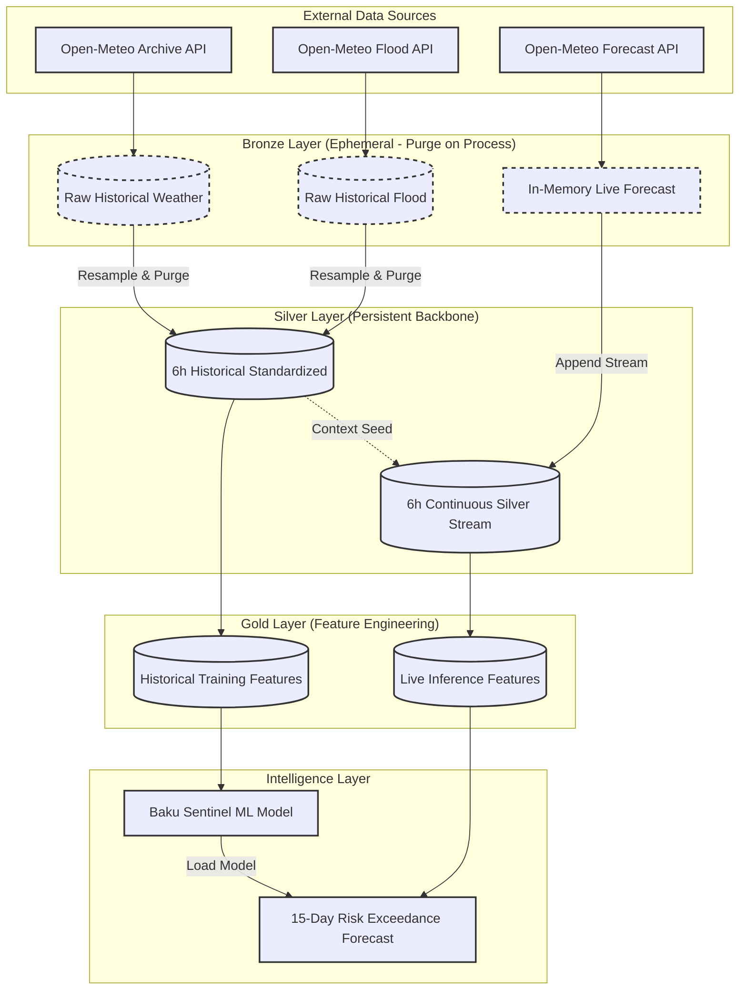

# Baku Sentinel: Advanced Flash Flood Forecasting System

## Team

| Name | Role                      |
|------|---------------------------|
| Ali Agabalazade | Lead ML / Data Engineer   |
| Nigar Rustamova | Data Analyst / Geospatial |
| Nəzrin Məmmədzadə | Project / Documentation   |
| İsgəndər Panahov (panahoff) | Presentator/Documentation |

---

## Task Breakdown

### Data & Research
- Dataset Discovery for Flood Detection  
- Labeling Strategy Design  
- Baseline Features & Open-Meteo Integration  

### Engineering
- Create ingestion pipeline  
- Mermaid pipeline visualization  
- Repository structure setup  
- Telegram + Oxu.az flood scraper  

### Feature Engineering
- Separation of Baku into 3 zones  
- Feature Engineering (lags, rolling, soil, etc.)

### Documentation & Delivery
- Project Plan README Creation  
- Finalize Day 1 Deliverables  
- Finalize Day 2 Deliverables  

---

## Task Ownership Matrix

| Task                                       | Owner         | Status |
|--------------------------------------------|---------------|--------|
| Labeling Strategy Design                   | Team          | Done |
| Baseline Features & Open-Meteo Integration | Ali + Panahov | Done |
| Dataset Discovery                          | Nigar         | Done |
| Flood News Scraper                         | Ali           | Done |
| README Creation                            | Nəzrin        | Done |
| Repo Structure                             | Ali           | Done |
| Ingestion Pipeline                         | Ali           | Done |
| Pipeline Diagram (Mermaid)                 | Panahov       | Done |
| Zone Separation (3 zones)                  | Nigar         | Done |
| Feature Engineering                        | All           | Done |
| Day 1 Deliverables                         | Team          | Done |
| Day 2 Deliverables                         | Nəzrin        | Done |
| Increase Model Precision                   | Ali/Rustemova | In Progress |
| Feature Engieering for second model        | Nazrin        | In Progress |
| UI for Demo (HTML/CSS/JS)                  | Panahov       | In Progress |

---

## Daily Progress

### Day 1 — April 18
- Labeling strategy defined  
- Dataset discovery completed  
- Open-Meteo feature selection  
- Flood news scraper built  

### Day 2 — April 19
- README and project documentation created  
- Baseline features finalized  

### Day 3 — April 20
- Repository structure created  
- Day 1 deliverables finalized  

### Day 4 — April 21
- Ingestion pipeline implemented  
- Mermaid architecture diagram created  
- Baku divided into 3 risk zones  
- Day 2 deliverables finalized  

### Ongoing
- Feature engineering for weather prediction
- Increasing precision of the model  
- Creating UI for presentation demo (HTML, CSS, JavaScript)

---

## Progress Summary

- Research: Complete  
- Data Engineering: Complete  
- Feature Engineering: Complete  
- Documentation: Complete  
- Modeling: In Progress  

---

### The Strategy: Efficiency & Continuity
*   **Purge-on-Process**: The pipeline standardizes years of hourly meteorological data into a 6-hourly Silver grain and immediately drops the raw Bronze schema, saving significant disk space.
*   **Contextual Continuity**: Predictive features (like 24h lags) require recent historical context. The system maintains a persistent **Silver Stream** (`weather_stream_6h`) that merges live forecasts with the most recent standardized history, ensuring zero feature mismatch during production.

---

## Executive Overview
Standard meteorological services typically focus on atmospheric events—predicting *if* it will rain. However, for a city like Baku, the critical question is not the rainfall itself, but the resulting inundation. Baku Sentinel integrates **terrain topology**, **subsurface saturation levels**, and **quantitative river discharge data** to predict localized flood events.

The core mission of Baku Sentinel is to answer:
> *Utilizing real-time precipitation forecasts and antecedent soil moisture data, what is the specific probability of flood-risk exceedance across Baku’s micro-zones over a 15-day horizon?*

---

## Ground Truth & Labeling Strategy (For Training)
Baku Sentinel is trained against a **quantitative proxy** to ensure objective results. 

*   **Source**: Open-Meteo Flood API (`river_discharge`).
*   **Thresholding**: Training samples are labeled as `is_flood = 1` only if the local river discharge exceeds a critical threshold of **1.0 m³/s**. 

---

## Geospatial Risk Stratification
The Baku metropolitan area is divided into three primary "Terrain Risk Zones" based on elevation and drainage potential.

| Zone | Designation | Elevation Profile | Risk Profile | Technical Rationale |
| :--- | :--- | :--- | :--- | :--- |
| **High Relief** | Upland Plateau | 100–200 m a.s.l. | 🟢 STABLE | Elevated plateau; rapid runoff with minimal local standing water risk. |
| **Moderate Relief** | Mid-Slope Belt | 20–60 m a.s.l. | 🟡 MODERATE | Transitional slope; functions as the primary runoff generation zone. |
| **Low Relief** | Lowland Core | 0–5 m a.s.l. | 🔴 CRITICAL | Coastal depression; primary accumulation point for regional runoff. |

---

## The "Sentinel Pipeline" (Analytical Feature Set)
The Sentinel Pipeline is the high-performance engine that transforms raw weather and hydrological data into high-fidelity predictive features.

### 1. Hydrological Momentum & Lags
*   **Temporal Offsets**: `precip_lag_6h` to `48h`. Tracks the "wave" of water moving through the system.
*   **Rolling Aggregates**: `precip_roll_sum_24h/48h/72h`. Quantifies the intensity and duration of rainfall events.
*   **Hydraulic Trends**: `discharge_trend_6h`. Detects rapid surges in river levels.

### 2. Saturation & Infiltration Dynamics
*   **Antecedent Precipitation Index (API-7D)**: A decay-weighted sum of historical rainfall representing current soil moisture stress.
*   **Soil Saturation Index (SSI)**: A unified moisture metric across multiple depth layers (0–28cm).
*   **Moisture Velocity**: `soil_moisture_change_6h`. Measures how fast the ground is reaching its absorption limit.

### 3. Spatial & Terrain Cascade Logic
*   **Zone Cascade Risk**: A gravity-driven risk multiplier that calculates the potential for upland runoff (High Relief) to inundate lowland zones.
*   **Cross-Zone Signals**: `highland_precip_24h`. Uses elevated relief zones as a "leading indicator" for coastal flood events.

---

# Flood Forecasting Models: System Specifications

## Baku Sentinel Model (Random Forest Classifier)

1.  **Training Data**: 6+ years of Archive + Flood API data (DuckDB Gold Layer).
2.  **Production Data**: 15-Day rolling live forecast via Open-Meteo Forecast API.
3.  **Granularity**: 6-hourly standardized grain (Silver Layer).
4.  **Target Variable**: `is_flood` (Binary) based on river discharge > 1.0 m³/s.
5.  **Model Performance (Baseline Validation)**:
    *   **ROC AUC**: 0.9991
    *   **PR AUC**: 0.8622
    *   **Recall (Flood Class)**: 0.88
