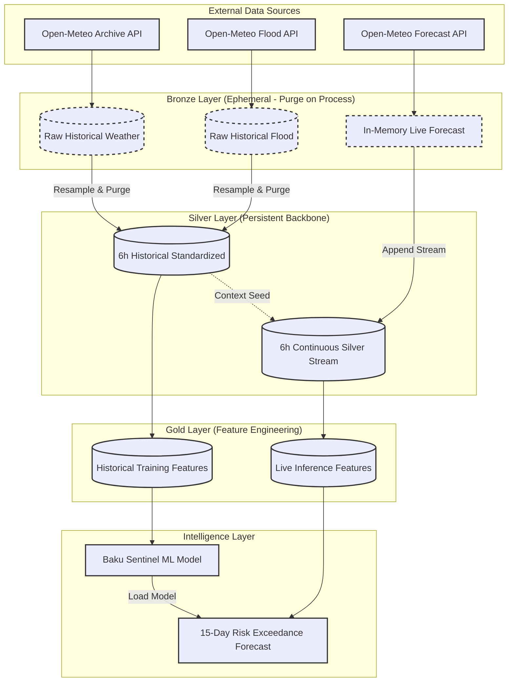

# 🌊 Baku Sentinel — Flash Flood Forecasting System

> ## **Team GALE**  

**Advanced flash flood risk prediction across Baku's terrain micro-zones using meteorological and hydrological data over a 30-day horizon.**

---

## Table of Contents

1. [Team](#team)
2. [Problem Statement](#problem-statement)
3. [Why It Matters](#why-it-matters)
4. [Target Variable](#target-variable)
5. [Dataset](#dataset)
6. [Geospatial Risk Zones](#geospatial-risk-zones)
7. [Feature Engineering](#feature-engineering)
8. [Pipeline Architecture](#pipeline-architecture)
9. [Model](#model)
10. [Key Definitions](#key-definitions)
11. [Daily Activities](#daily-activities)
12. [Task Ownership](#task-ownership)
13. [Repository Structure](#repository-structure)

---

## Team

**Team Name:** Gale

| Name | Role |
|------|------|
| Ali Agabalazade | Lead ML / Data Engineer |
| Nigar Rustamova | Data Analyst / Geospatial |
| Nazrin Mammadzadeh | Project Manager / Documentation |
| Isgandar Panahov | Presentation / Documentation |

---

## Problem Statement

Standard meteorological services predict *if* it will rain. For Baku, however, the critical and often unanswered question is not the rainfall itself — it is the resulting **inundation**.

Baku sits at the intersection of three compounding risk factors:

- **Lowland coastal geography** — large portions of the city sit near sea level, with nowhere for water to drain
- **Impermeable urban surfaces** — rapid runoff with no natural absorption in dense neighbourhoods
- **Highly variable terrain** — elevation shifts from 0 m (coastal core) to 200 m (upland plateau) across a short distance, creating gravity-driven flood cascades


No dedicated, zone-aware flood forecasting system currently exists for Baku.   
Baku Sentinel fills that gap by integrating **terrain topology**,
**subsurface soil saturation**, and **quantitative river discharge data**
to produce **zone-specific probabilistic flood forecasts** before
conditions become dangerous.

### **The core question Baku Sentinel is designed to answer:**

> "Can the integration of a 15-day Open-Meteo operational forecast with a model-generated weather extension for days 16–30 accurately classify deterministic flood-risk events across Baku’s topographic micro-zones over a rolling 30-day horizon?"

---

Bağışla, elə bildim azərbaycancasını istəyirsən. Budur, Bakının real infrastruktur problemlərini və sənin dediyin o "hərəkətin iflic olması" məsələsini özündə cəmləyən tam professional ingiliscə variant:

---

## Why It Matters

In Baku, flash floods are not merely a natural phenomenon; they represent a total **systemic paralysis** of the city’s aging infrastructure. This project is critical for several real-world reasons:

* **Logistical Paralysis and "Tunnel Traps":** Baku’s drainage and sewage systems are largely outdated and cannot cope with modern precipitation intensity. Key transit arteries, particularly underpasses and tunnels (such as the Sabunçu tunnel), transform into dangerous water traps within minutes. The sight of buses and vehicles submerged is not just a delay—it is a direct threat to public safety.
* **Urban Mobility and Pedestrian Paralysis:** The crisis is not limited to vehicles; it deeply affects daily human movement. Poor drainage turns sidewalks into impassable basins and covers streets in a layer of mud and stagnant water. For the average citizen, simple transit becomes an obstacle course, effectively paralyzing pedestrian mobility and cutting off access to public transport hubs and essential services.
* **Invisible Soil Saturation:** In a heavily "concretized" city like Baku, natural absorption is minimal. However, during consecutive rainy days, the remaining soil layers and green zones reach a saturation "tipping point." Our system tracks this "soil memory," predicting when even a moderate rainfall will trigger a catastrophic surface runoff.
* **Zone-Specific Precision vs. Alert Fatigue:** Issuing a blanket flood warning for the entire city is ineffective and leads to public indifference. Because of Baku’s unique topography, one district may remain dry while another is underwater. Micro-zone forecasting allows for a proportional, targeted response that saves resources and maintains public trust.

---

## Target Variable

| Property | Definition |
|----------|------------|
| **Variable name** | `is_flood` |
| **Type** | Binary (0 = No Flood, 1 = Flood) |
| **Source** | Open-Meteo Flood API — `river_discharge` field |
| **Threshold** | `is_flood = 1` when `river_discharge > 1.0 m³/s` |
| **Granularity** | 6-hourly (resampled from hourly source) |
| **Rationale** | 1.0 m³/s represents the empirical exceedance threshold at which local drainage systems in Baku's risk zones are overwhelmed, based on historical flood event correlation |

The threshold-based labeling strategy was chosen deliberately over subjective news-scraping labels to ensure **reproducibility**, **objectivity**, and **quantitative traceability** of the flood definition.

---

## Dataset

| Property | Detail |
|----------|--------|
| **Sources** | Open-Meteo Archive API (weather), Open-Meteo Flood API (discharge), Open-Meteo Forecast API (live) |
| **Historical range** | 2020-01-01 → 2026-04-20 |
| **Forecast horizon** | 30 days rolling |
| **Raw granularity** | Hourly |
| **Processed granularity** | 6-hourly (Silver layer standard) |
| **Spatial coverage** | Baku metropolitan area, Azerbaijan |
| **Zones** | 3 terrain-based micro-zones (see below) |
| **Total historical rows** | 55,248 hourly rows per zone (weather) · 2,302 daily rows per zone (flood) |
| **Missing values** | 0 gaps, 0 nulls across all datasets (validated) |
| **Storage format** | CSV (raw) · DuckDB (Silver/Gold layers) 

---

## Geospatial Risk Zones

Baku is divided into three **Terrain Risk Zones** derived from GADM (Database of Global Administrative Areas) administrative boundaries and digital elevation models.

| Zone | Designation | Elevation (m a.s.l.) | Risk Level | Rationale |
|------|-------------|----------------------|------------|-----------|
| **High Relief** | Upland Plateau | 100 – 200 m | 🟢 STABLE | Elevated terrain enables rapid runoff; minimal local standing water, but acts as the primary runoff *source* for downstream zones |
| **Moderate Relief** | Mid-Slope Belt | 20 – 60 m | 🟡 MODERATE | Transitional slope zone; functions as the primary runoff *generation* corridor connecting highland to lowland |
| **Low Relief** | Lowland Core | 0 – 5 m | 🔴 CRITICAL | Coastal depression; gravity-driven accumulation point for regional runoff from all uphill zones |

Zone coordinates used in the pipeline:
- **High Relief**: lat `40.45`, lon `49.85`
- **Low Relief**: lat `40.37`, lon `49.85`
- **Moderate Relief**: lat `40.41`, lon `49.85`

---

## Feature Engineering

The **Sentinel Feature Pipeline** transforms raw meteorological and hydrological inputs into 30+ predictive signals across three thematic groups.

### Group 1 — Hydrological Momentum & Lags

These features track how water is moving *through* the terrain system over time.

| Feature Name | Source Variable | Unit | Aggregation | Description |
|---|---|---|---|---|
| `precip_lag_6h` | `precipitation` | mm | Lag offset | Precipitation recorded 6 hours ago |
| `precip_lag_12h` | `precipitation` | mm | Lag offset | Precipitation recorded 12 hours ago |
| `precip_lag_24h` | `precipitation` | mm | Lag offset | Precipitation recorded 24 hours ago |
| `precip_lag_48h` | `precipitation` | mm | Lag offset | Precipitation recorded 48 hours ago |
| `precip_roll_sum_24h` | `precipitation` | mm | Rolling sum (24h) | Total precipitation in last 24 hours |
| `precip_roll_sum_48h` | `precipitation` | mm | Rolling sum (48h) | Total precipitation in last 48 hours |
| `precip_roll_sum_72h` | `precipitation` | mm | Rolling sum (72h) | Total precipitation in last 72 hours |
| `discharge_trend_6h` | `river_discharge` | m³/s | Delta (6h) | Rate of change in river flow — detects surging events |

### Group 2 — Saturation & Infiltration Dynamics

These features quantify how close the soil is to its absorption limit, determining whether rainfall becomes runoff or is absorbed.

| Feature Name | Source Variable | Unit | Aggregation | Description |
|---|---|---|---|---|
| `api_7d` | `precipitation` | mm | Exponential decay sum (7d) | Antecedent Precipitation Index — decay-weighted historical rainfall representing current soil moisture stress |
| `soil_saturation_index` | `soil_moisture_0_to_7cm`, `soil_moisture_7_to_28cm` | m³/m³ | Weighted mean | Unified soil moisture metric across 0–28 cm depth layers |
| `soil_moisture_change_6h` | `soil_moisture_0_to_7cm` | m³/m³ | Delta (6h) | Rate of soil moisture increase — measures how fast ground is reaching saturation |

### Group 3 — Spatial & Terrain Cascade Logic

These features encode the physical gravity-driven relationship between Baku's terrain zones — highland rain becomes lowland flood.

| Feature Name | Source Variable | Unit | Aggregation | Description |
|---|---|---|---|---|
| `highland_precip_24h` | `precipitation` (High Relief zone) | mm | Rolling sum (24h) | Upland precipitation as a leading indicator for coastal inundation |
| `zone_cascade_risk` | `highland_precip_24h`, zone elevation | index | Weighted composite | Gravity-driven risk multiplier: upland runoff potential scaled by terrain drop |

### Base Meteorological Variables (Inputs)

| Variable | Unit | Source | Granularity |
|---|---|---|---|
| `precipitation` | mm | Open-Meteo Archive / Forecast API | Hourly → 6h |
| `temperature_2m` | °C | Open-Meteo Archive / Forecast API | Hourly → 6h mean |
| `wind_speed_10m` | km/h | Open-Meteo Archive / Forecast API | Hourly → 6h mean |
| `soil_moisture_0_to_7cm` | m³/m³ | Open-Meteo Archive API | Hourly → 6h mean |
| `soil_moisture_7_to_28cm` | m³/m³ | Open-Meteo Archive API | Hourly → 6h mean |
| `river_discharge` | m³/s | Open-Meteo Flood API | Daily → 6h (forward-fill) |

---

## Pipeline Architecture

Baku Sentinel follows a **Medallion Architecture** (Bronze → Silver → Gold) with a Purge-on-Process strategy.




**Design Decisions:**
- **Purge-on-Process:** Raw hourly Bronze data is processed into 6-hourly Silver grain and immediately discarded, saving significant disk space while preserving analytical fidelity.
- **Contextual Continuity:** Lag features (e.g., `precip_lag_48h`) require recent historical context at inference time. The Silver Stream (`weather_stream_6h`) merges live forecast data with the most recent standardized history, ensuring zero feature mismatch between training and production.

---

## Model

| Property | Detail                                          |
|----------|-------------------------------------------------|
| **Algorithm** | Random Forest Classifier                        |
| **Training data** | 6+ years of Silver-layer features (2020–2026)   |
| **Validation strategy** | Stratified K-Fold Cross-Validation              |
| **Input granularity** | 6-hourly                                        |
| **Output** | `is_flood` probability per zone per 6h timestep |
| **Forecast horizon** | 30 days (360 6h-steps)                          |
| **ROC AUC (baseline)** | **0.9991**                                      |
| **PR AUC (baseline)** | **0.9845**                                       |

The high ROC AUC reflects the model's ability to cleanly distinguish flood from non-flood conditions. The PR AUC and Recall metrics are the primary focus given the severe class imbalance inherent in flood data — correctly identifying actual flood events matters more than overall accuracy.

---

## Key Definitions

| Term | Definition |
|------|------------|
| **Flash Flood** | Rapid, localised inundation caused by short-duration high-intensity precipitation or cascading terrain runoff, typically occurring within 6 hours of the triggering event |
| **River Discharge** | Volumetric flow rate of water past a cross-section of a river (unit: m³/s); the primary ground-truth flood proxy used for labeling |
| **Antecedent Precipitation Index (API-7D)** | An exponential decay-weighted accumulation of rainfall over the preceding 7 days, used as a proxy for current soil moisture memory |
| **Soil Saturation Index (SSI)** | A weighted composite of volumetric water content across 0–7 cm and 7–28 cm soil depth layers; measures how close the ground is to full saturation |
| **Terrain Cascade Risk** | A zone-level risk multiplier that quantifies how much upland (High Relief) precipitation is gravitationally channelled toward the lowland (Low Relief) core |
| **Silver Grain** | The standardised 6-hourly timestep used as the canonical analytical unit throughout the pipeline |
| **Bronze Layer** | Ephemeral raw ingestion data; purged from disk once Silver processing is complete |
| **Gold Layer** | Fully feature-engineered dataset ready for model training or inference |
| **Exceedance Probability** | The probability that flood severity will exceed the defined threshold (`river_discharge > 1.0 m³/s`) within a given forecast window |

---

## Daily Activities

| Day | Date | Key Activities |
|-----|------|----------------|
| **Day 1** | April 18 | Labeling strategy defined · Dataset discovery completed (Kaggle, FHN official PDFs) · Open-Meteo API exploration + feature schema initiated · Baku flood news scraper built (Telegram + Oxu.az, LLM deduplication) |
| **Day 2** | April 19 | README and project documentation created · Baseline meteorological features finalised · Open-Meteo feature schema locked · Day 1 deliverables submitted |
| **Day 3** | April 20 | Repository structure initialised · Ingestion pipeline implemented with date validation and retry logic · Raw data validated (0 gaps, 0 nulls) · Day 1 deliverables finalised and pushed |
| **Day 4** | April 21 | Baku separated into 3 terrain-based risk zones · Ingestion pipeline run end-to-end in notebook · Mermaid architecture diagram created · Feature engineering completed by all members · Baseline Random Forest trained and scored · Day 2 deliverables finalised |
| **Ongoing** | April 22+ | Model precision improvement · Feature engineering for second model · Demo UI development (HTML/CSS/JS) |

---

## Task Ownership

| Task | Owner | Due | Status |
|------|-------|-----|--------|
| Labeling Strategy Design | Team | April 18 | ✅ Done |
| Dataset Discovery | Nigar | April 18 | ✅ Done |
| Baku Flood News Scraper (Telegram + Oxu.az) | Ali | April 18 | ✅ Done |
| Baseline Features & Open-Meteo Integration | Ali + Panahov | April 19 | ✅ Done |
| README Creation | Nəzrin | April 19 | ✅ Done |
| Finalize & Submit Day 1 Deliverables | Team | April 20 | ✅ Done |
| Repository Structure | Ali | April 20 | ✅ Done |
| Zone Separation (3 zones) | Nigar | April 21 | ✅ Done |
| Ingestion Pipeline | Ali | April 21 | ✅ Done |
| Pipeline Diagram (Mermaid) | Panahov | April 21 | ✅ Done |
| Finalize Day 2 Deliverables | Nəzrin | April 21 | ✅ Done |
| Feature Engineering | All | — | ✅ Done |
| Increase Model Precision | Ali + Nigar | — | 🔄 In Progress |
| Feature Engineering (Model 2) | Nəzrin | — | 🔄 In Progress |
| Demo UI (HTML/CSS/JS) | Panahov | — | 🔄 In Progress |

---

## Repository Structure

```
Baku-Sentinel-Advanced-Flash-Flood-Forecasting-System/
│
├── daily-briefs/                    # Daily brief placeholders
│   └── .gitkeep
│
├── notebooks/                       # Jupyter exploration & pipeline notebooks
│   ├── day_01_baku_zones.ipynb      # Geospatial zone definition
│   ├── day_01_exploration.ipynb     # API exploration per team member
│   ├── day_02_ingestion.ipynb       # Data ingestion & validation audit
│   ├── day_03_exploration_baseline.ipynb  # Feature engineering + baseline model
│   ├── day_04_baku_sentinel.ipynb   # Baku Sentinel end-to-end forecast
│   └── day_04_pipeline_forecast.ipynb    # Full production pipeline + forecast
│
├── reports/
│   └── figures/                     # Report figures placeholder
│       └── .gitkeep
│
├── src/                             # Core Python package
│   ├── __init__.py
│   ├── config.py                    # Zone definitions, API endpoints, constants
│   ├── feature_engineering.py       # Feature transformation logic
│   ├── ingestion.py                 # Open-Meteo API fetch functions
│   ├── main.py                      # Entry point
│   ├── model.py                     # Model definition and training
│   ├── pipeline.py                  # Silver/Gold transformation logic
│   └── predict.py                   # Inference and forecast generation
│
├── .gitignore
├── README.md
└── requirements.txt
```

---

